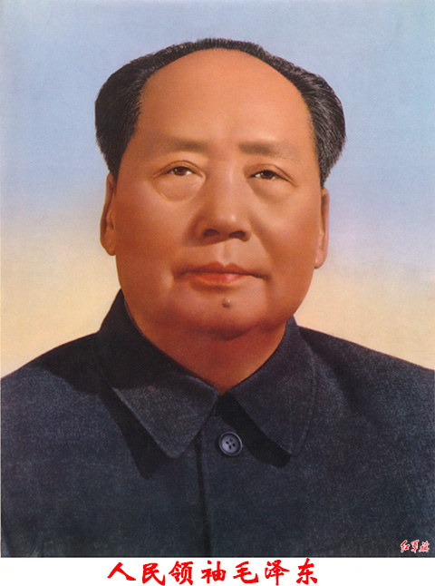

伟大的领袖和导师毛泽东主席，是中国共产党的缔造者，是当代最伟大的马克思列宁主义者。毛主席把马克思列宁主义的普遍真理和革命的具体实践相结合，在反对帝国主义和国内反动阶级的斗争中，在反对党内右的和“左”的机会主义路线的斗争中，在反对国际现代修正主义的斗争中，继承、捍卫和发展了马克思列宁主义。毛主席领导我党我军和我国人民，经过长期的革命斗争和革命战争，取得了新民主主义革命的彻底胜利，建立了无产阶级专政的中华人民共和国，接着又经过无产阶级和资产阶级激烈的复杂的斗争，经过史无前例的无产阶级文化大革命，取得了社会主义革命和社会主义建设的伟大胜利。毛主席的旗帜，是我们党团结战斗、争取胜利的伟大旗帜。

中国共产党章程（1977年8月18日中国共产党第十一次全国代表大会通过）

------

毛泽东同志指出：

社会主义社会是一个相当长的历史阶段。在社会主义这个历史阶段中，还存在着阶级、阶级矛盾和阶级斗争，存在着社会主义同资本主义两条道路的斗争，存在着资本主义复辟的危险性。要认识这种斗争的长期性和复杂性。要提高警惕。要进行社会主义教育。要正确理解和处理阶级矛盾和阶级斗争问题，正确区别和处理敌我矛盾和人民内部矛盾。不然的话，我们这样的社会主义国家，就会走向反面，就会变质，就会出现复辟。

毛主席：《在中国共产党八届十中全会上的讲话》（一九六二年九月）

---

什么人站在革命人民方面，他就是革命派，什么人站在帝国主义封建主义官僚资本主义方面，他就是反革命派。什么人只是口头上站在革命人民方面而在行动上则另是一样，他就是一个口头革命派，如果不但在口头上而且在行动上也站在革命人民方面，他就是一个完全的革命派。

毛泽东同志在中国人民政治协商会议第一届全国委员会第二次会议上的闭幕词

------

如果资本主义复辟，无产阶级就会吃二遍苦、受二茬罪吗?

你太高看他们了，他们懂什么是资本主义?最多倒退回半封建、半殖民地社会。资本主义是靠侵略和掠夺别的国家而积累资产的，他们敢侵略谁呀？不被侵略就阿弥陀佛喽。

他们只能是充当帝国主义的代理人，剥削和压迫本民族的百姓，或者贱卖自己国家的资源，以满足自己贪得无厌的私欲。

毛泽东1972.7.3

------

**一九八一年六月二十七日中国共产党第十一届六中全会通过《关于建国以来党的若干历史问题的决议》，否定了毛泽东主席的“无产阶级专政下继续革命理论”，否定了文化大革命，华国锋下台，至此，走资派势力全面复辟。**

------

形左实右在另一个代价是在一定程度上（难以定量统计）失去了民族自信心。

毛的自力更生政策，无论其付出了什么经济损失，却使人民群众形成了一个坚定的信念，即中国人民依靠自己的努力能够创造光明的未来。在一个长期受到西方列强支配和欺侮的国家里，这种民族自信心的意义怎么估计都不为过。

但是，在后毛时代的领导人把西方资本主义的手段和技术当成医治中国问题的万能良药后，民族自信心受到致命的打击，客观上导致了西蒙·利斯叹息的“对西方盲目崇拜的突然再生”。“盲目崇拜”可能反而导致民族主义，可以预见，在以后的年代里，民族主义的情绪会越来越强烈和极端。

——莫里斯·迈斯纳：毛泽东的中国及其后

在毛时代，工业总产值增加了38倍，重工业增加了90倍。从1952年（工业产量恢复到历史最高水平）到1977年，中国工业产量以年平均11.3%的速度递增，在现代世界历史上，与任何国家在类似的发展阶段上相比，中国的发展速度都是惊人的。

正如一位著名的澳大利亚经济学家所说：工业份额在国民收入中如此迅速增长（几乎是30%）的现象在历史上是罕见的。在工业化进程的最初40至50年中，英国的工业产值的比重仅仅上升了11%（1801—1841）；日本是22%（1878/82—1923/27）。在战后新兴的工业化国家和地区中，也许只有台湾在这方面的发展速度才可与中国大陆相媲美。从1952年到1976年，钢产量从130万吨增加到2300万吨；煤产量从6600万吨增加到4.48亿吨；发电量从70亿千瓦/小时增加到1330亿千瓦/小时；原油产量从几乎是零到2800万吨；化肥产量从20万吨增加到2800万吨；水泥产量从300万吨增加到4900万吨。到1970年代中期，中国能够生产喷气式飞机、重型拖拉机和远洋轮船，中国还能够制造原子弹和洲际导弹，在成功地进行了首次核试验六年后，中国于1970年发射了人造卫星。中国还建立了一支新型的技术知识分子队伍，中国的科技人员从1949年的区区5万人（1952年为42.5万人）增加到1966年的250万人，1979年达到500万人，其中99%是1949年后培养起来的。毛时代还兴建了巨大的灌溉和水利工程，

这些工程对1980年代初期农业生产的发展高潮起了重要的作用。毛泽东时代让中国从一个彻底的农业国，成长为世界主要的工业大国。这是人类历史上罕见的发展速度和成果。然而，在毛时代之后，由于某些不可描述的人和原因，宣传上对这些成就几乎只字不提，但却对于那个时代的错误却吹毛求疵。
